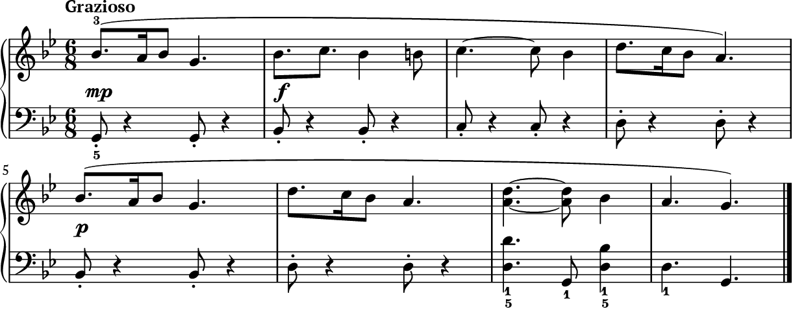
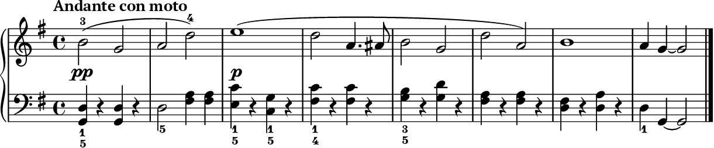
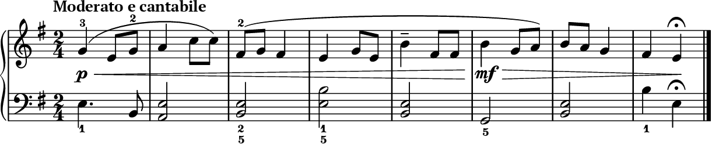

# Grade 4 audit — 3 audited

keep: 0  revise: 3  bin: 0

## #3 — REVISE (distinctiveness 4)
Grazioso, G min, 6/8  ·  
- **grade-fit:** right — 6/8 compound with a dotted-quaver-semiquaver idiom (bars 1, 4, 6) and a ties/tenuto vocabulary sits squarely at Grade 4; the B natural in bar 2 is the single permitted chromatic passing note. Textures stay within two parts and accidentals never exceed the cap. The bar 7 three-note LH chord shift (D3+D4, then G2, then D3+Bb3) is the only slightly busy spot but is manageable at speed.
- **freshness:** somewhat_derivative — The over-use data flags falling contour at 68% of the bank, and this piece's phrases are dominated by descending shapes (Bb-A-Bb-G, D-C-Bb-A). The structure is more sectional/repetitive than the over-used "contrasting" tag, so it dodges that cliché, but the falling contour is squarely in the crowded zone.
- **musicality:** acceptable — There is genuine repetition-with-variation: bar 1's motif returns in bar 5 varied by dynamic (mp/p) and continuation, and the LH grows from a detached crotchet-and-rest ostinato into a fuller chordal cadence in bars 7-8, giving real shape. However the LH for bars 1-6 is essentially one tiled figure (quaver + crotchet-rest) simply transposed up the harmony (G, Bb, C, D, Bb, D), which reads as a mechanical harmonic tiling rather than a voice with its own melodic shape — that flattens the Grazioso character.
- **fingering:** ok — RH 1 on Bb4 with the reach up to D5/C5 is a sensible five-finger-plus shape; LH 5 on G2 fits the opening, and the marked 1/5 at the bar 7-8 chords is conventional and clear.
- A neat, correctly-graded 6/8 Grazioso with decent RH motif variation, but the LH is a tiled harmonic ostinato for six bars and the falling contour sits in an over-used zone, so it reads correct-but-a-bit-dry.

## #1 — REVISE (distinctiveness 3)
Andante con moto, G maj, 4/4  ·  
- **grade-fit:** right — The RH stays in a comfortable G-major fifth-ish range with minims and a single dotted-crotchet/quaver figure in bar 4, and the LH is simple crotchet chords with rests — all within Grade 4. The one chromatic note (A#4 in bar 4, matched by the LH F#/C# hint) is exactly the single allowed chromatic passing/leading tone, and accidentals stay within the cap. Nothing exceeds the spec.
- **freshness:** over_used — The over-use data flags "contrasting" structure at 75% and "falling" contour at 68% of the bank; this piece is squarely both — a broadly descending RH line over a contrasting texture, so it treads very well-worn ground rather than offering anything new.
- **musicality:** acceptable — The motif does recur with variation (bars 1–2 answered and reshaped at bars 5–6, cadence bars 7–8), the A#4 in bar 4 gives a small expressive lift, and the slurred phrasing plus pp/p dynamic scheme give some character. But the LH is essentially one on-beat crotchet-chord-plus-rest figure tiled across nearly every bar (skeleton 0.85, strongRests 0), which reads as a slightly dry accompaniment rather than a LH with its own melodic shape, and the whole thing leans on the over-used falling/contrasting mould.
- **fingering:** ok — RH 1 start on B4 with the marked 3–4 shifts and LH 5 on the opening G/D chord are sensible; the LH finger changes (1/5, 5, 1/4, 3/5, 1) sit naturally under the hand for the chord positions given.
- Correct, playable and grade-appropriate with a nice single chromatic touch, but the LH is a tiled crotchet-chord figure and the whole conception (falling contour, contrasting texture) sits deep in the over-used part of the bank.

## #2 — REVISE (distinctiveness 3)
Moderato e cantabile, E min, 2/4  ·  
- **grade-fit:** right — The RH stays within a comfortable G4–C5 span with simple crotchet/quaver motion and one fermata at the close (bar 8), all appropriate for Grade 4. The LH is mostly held minim double-stops with a single dotted-crotchet opening figure; the F#4 chromatic/leading-note colour and the tenuto in bar 5 sit inside the spec. Nothing exceeds three accidentals or the note-count ceiling.
- **freshness:** over_used — The over-use data flags "contrasting" structure at 75% and "falling" contour at 68% of the bank, and this piece is exactly that: a gently falling, contrasting cantabile in a minor key — the most common template already saturating the bank.
- **musicality:** weak — The objective motif flag is false and skeleton is very high at 0.88, confirming the melody is a generic step-and-hop line without a recurring, varied motif — it reads as pleasant but shapeless. The left hand is the bigger problem: after bar 1 it collapses into a chain of held minim double-stops (bars 2–7 are almost all block harmonies with no independent line or rhythmic life), so the "two-part texture" the grade wants is really a tune-over-drones accompaniment, not a voice with its own shape.
- **fingering:** ok — RH starting on 1 for G4 with the marked 3 and 2 above sits the hand naturally in the G–C position; LH 5 on the low E and the marked 2/5 shapes for the double-stops are conventional and reachable.
- A tidy, playable but generic falling-cantabile in E minor whose motionless minim-chord left hand and absent motif make it read as correct-but-dry — revise the LH into a real voice and sharpen the melodic recurrence.
